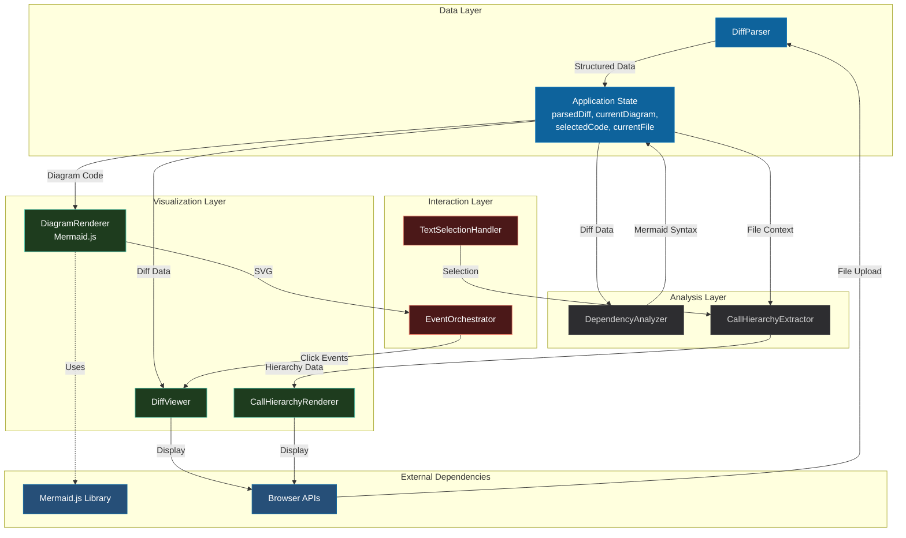
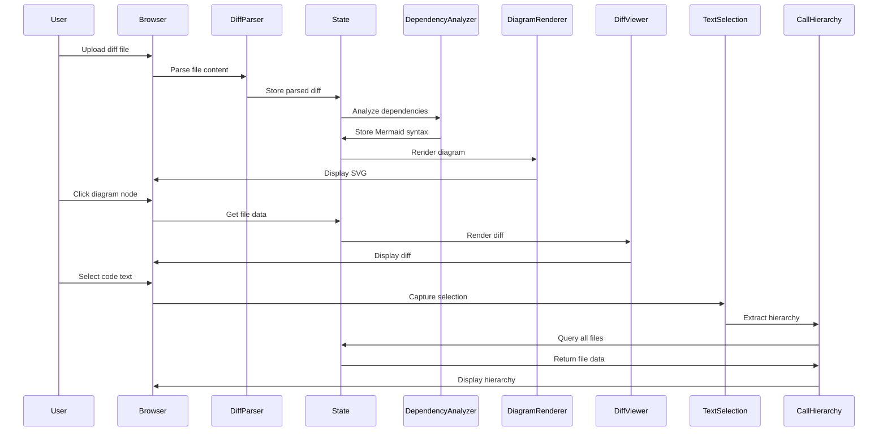
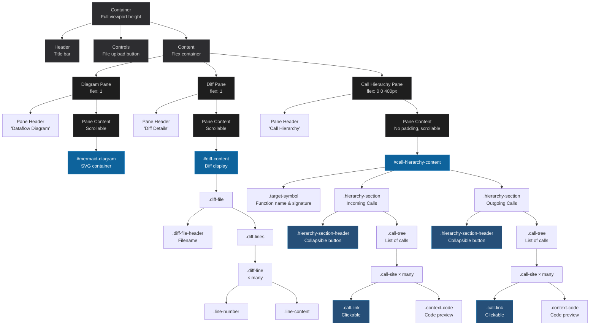
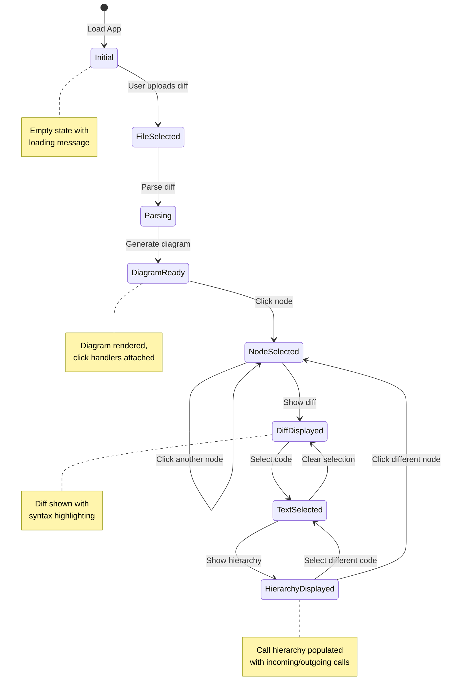
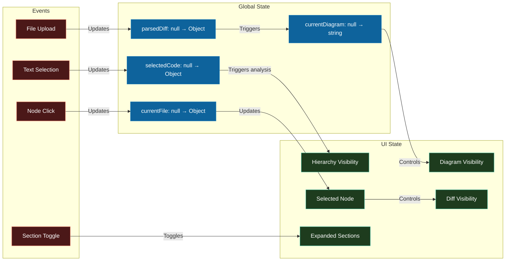
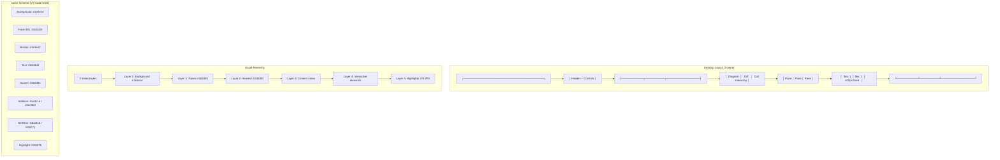
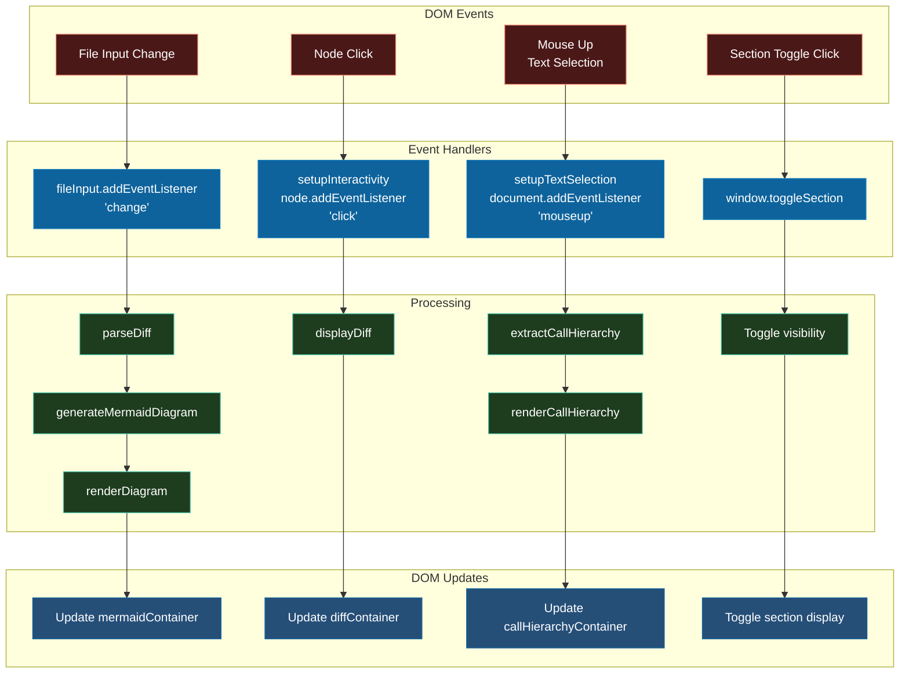
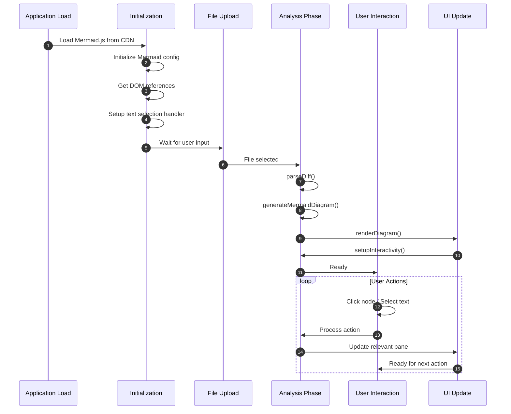
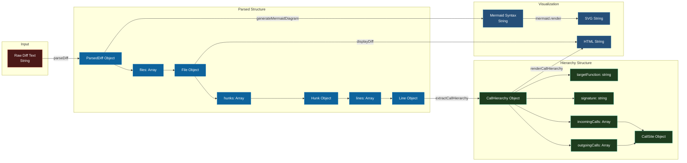

# Code Review Tool - Mermaid Diagrams

## Prototype Component Architecture

### Component Dependencies

### Data Flow Sequence

### Component Interaction Map

```mermaid
graph LR
    subgraph "Component 1: DiffParser"
        P1[Input: Raw diff text]
        P2[Process: Line-by-line parsing]
        P3[Output: Structured JSON]
        P1 --> P2 --> P3
    end

    subgraph "Component 2: DependencyAnalyzer"
        D1[Input: Parsed diff]
        D2[Process: Pattern matching<br/>for imports]
        D3[Output: Mermaid graph<br/>syntax string]
        D1 --> D2 --> D3
    end

    subgraph "Component 3: DiagramRenderer"
        R1[Input: Mermaid syntax]
        R2[Process: mermaid.render]
        R3[Output: SVG string]
        R1 --> R2 --> R3
    end

    subgraph "Component 4: DiffViewer"
        V1[Input: File object]
        V2[Process: Build HTML<br/>with line numbers]
        V3[Output: Rendered diff]
        V1 --> V2 --> V3
    end

    subgraph "Component 5: EventOrchestrator"
        E1[Input: Click events]
        E2[Process: Node selection<br/>& highlighting]
        E3[Output: Trigger diff<br/>display]
        E1 --> E2 --> E3
    end

    subgraph "Component 6: CallHierarchyExtractor"
        C1[Input: Selected text]
        C2[Process: Function<br/>detection & search]
        C3[Output: Call hierarchy<br/>object]
        C1 --> C2 --> C3
    end

    subgraph "Component 7: CallHierarchyRenderer"
        H1[Input: Hierarchy object]
        H2[Process: Build tree<br/>HTML]
        H3[Output: Rendered tree]
        H1 --> H2 --> H3
    end

    P3 --> D1
    D3 --> R1
    P3 --> V1
    R3 --> E1
    E3 --> V1
    V3 --> C1
    C3 --> H1
```

---

## UI Structure

### Layout Hierarchy

### User Interaction Flow

### Component State Flow

### Responsive Layout Structure

### Event Handling Architecture

---

## Component Lifecycle

---

## Data Structure Flow

